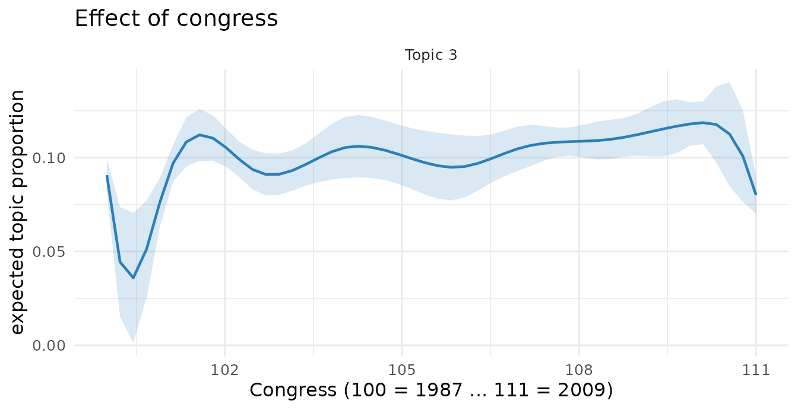

# Beyond stm: faSTM's extensions

The [companion
vignette](https://nealcaren.github.io/faSTM/articles/faSTM.md) shows
that faSTM runs the *same* analysis as the `stm` package. This one
covers what faSTM adds **on top of** that framework: multiple content
covariates, a richer and more honest
[`estimateEffect()`](https://nealcaren.github.io/faSTM/reference/estimateEffect.md),
alternative coherence metrics, and a tidyverse-friendly surface. None of
these require leaving the `stm`-compatible object — they are extra
tools, not a different model.

We use a second bundled corpus, `congress`: a balanced sample of **1,679
U.S. House and Senate floor speeches**, Congresses 100–111 (1987–2011),
with metadata `party` (Democrat/Republican), `chamber` (House/Senate),
and `congress` (the time index). It is built for exactly this vignette —
two categorical covariates that cross, plus a time axis.

``` r

library(faSTM)
data(congress)
congress
#> <faSTM_corpus> 1679 documents, 4110 vocabulary terms, 3 metadata columns
table(congress$meta$party, congress$meta$chamber)
#>             
#>              House Senate
#>   Democrat     420    420
#>   Republican   419    420
```

We fit one prevalence model — topic prevalence as a function of
**party** and a smooth of **time** — and reuse it throughout.

``` r

fit <- stm(congress, K = 12, prevalence = ~ party + s(congress),
           verbose = FALSE)
```

## Multiple content covariates

`stm` allows a single content (SAGE) covariate. faSTM accepts several
and crosses them into a **saturated** content model — one topic-word
distribution per combination of levels. Here `party` (2) × `chamber` (2)
gives a 4-group content model, so we can read how *Democrats vs
Republicans* and *House vs Senate* word each topic differently:

``` r

fitC <- stm(congress, K = 12,
            prevalence = ~ party + s(congress),
            content    = ~ party + chamber,    # crossed -> 4 SAGE groups
            verbose = FALSE)
fitC$settings$dim$A                            # number of content groups
#> [1] 4
```

The fit reports the crossing as it runs, and `stm`’s SAGE tooling works
unchanged on the result:

``` r

sageLabels(fitC, n = 5)          # top words per topic, per party×chamber group
labelTopics(fitC, topics = 3)
```

The crossed levels are stored on the fit
(`settings$covariates$contentvars`, `contenttable`) so per-covariate
marginals can be recovered later.

### Framing, not agenda

Content covariates are where the interesting partisan signal lives.
Above, `estimateEffect` will show that Democrats and Republicans devote
*similar prevalence* to the budget/tax topic — but they **word it very
differently**. A `~ party` content model makes that concrete:

``` r

fitParty <- stm(congress, K = 12, prevalence = ~ party + s(congress),
                content = ~ party, verbose = FALSE)
sl  <- sageLabels(fitParty, n = 10)
tax <- which(apply(sl$marginal, 1, function(w) any(grepl("^tax", w))))[1]

sl$marginal[tax, ]              # shared topic vocabulary
#>  [1] "tax"        "budget"     "families"   "billion"    "health"    
#>  [6] "government" "pay"        "care"       "spending"   "jobs"
sl$bygroup$Democrat[tax, ]     # how Democrats word it
#>  [1] "health"         "sick"           "care"           "insurance"     
#>  [5] "profits"        "reconciliation" "children"       "foster"        
#>  [9] "birth"          "denied"
sl$bygroup$Republican[tax, ]   # how Republicans word it
#>  [1] "taxing"    "harbor"    "blame"     "green"     "error"     "criticize"
#>  [7] "computers" "taxed"     "extra"     "authority"
```

The shared vocabulary is fiscal (tax, budget, spending), but Democrats
reach for *health, care, children, preexisting, denied* while
Republicans reach for *taxing, taxed, CBO, authority* — same topic,
opposite framing. This is the distinction prevalence covariates can’t
capture and content (SAGE) covariates can.

## Honest `estimateEffect()`: cluster-robust SEs and weights

faSTM keeps `stm`’s method-of-composition uncertainty (re-drawing topic
proportions per simulation) and adds design features grouped data
usually needs.

**Cluster-robust standard errors** — speeches within a Congress are not
independent, so we cluster by `congress`. faSTM swaps the classical vcov
for a sandwich estimator with `stm`’s finite-sample correction:

``` r

eff <- estimateEffect(1:12 ~ party + s(congress), fit,
                      metadata = congress$meta,
                      cluster = congress$meta$congress, nsims = 25)
summary(eff, topics = 3)
#> faSTM estimateEffect (Global uncertainty, 25 draws)
#> 
#> topic3:
#>                 Estimate Std. Error t value Pr(>|t|)
#> (Intercept)       0.0907     0.0045 20.0289   0.0000
#> partyRepublican   0.0046     0.0067  0.6816   0.4956
#> s(congress)1     -0.1038     0.0334 -3.1050   0.0019
#> s(congress)2      0.0663     0.0219  3.0286   0.0025
#> s(congress)3     -0.0224     0.0154 -1.4547   0.1460
#> s(congress)4      0.0326     0.0178  1.8359   0.0665
#> s(congress)5     -0.0065     0.0156 -0.4167   0.6769
#> s(congress)6      0.0203     0.0122  1.6706   0.0950
#> s(congress)7      0.0153     0.0139  1.1027   0.2703
#> s(congress)8      0.0297     0.0218  1.3633   0.1730
#> s(congress)9      0.0282     0.0257  1.0992   0.2719
#> s(congress)10    -0.0106     0.0052 -2.0476   0.0408
#>   R-squared: 0.005 | F(11,1667): 0.79
```

[`summary()`](https://rdrr.io/r/base/summary.html) also takes
`p.adjust.method` (e.g. `"BH"`) to correct across topics, and reports
per-equation R² and F diagnostics. **Survey weights** enter the same way
via `weights =` (weighted least squares per draw).

## Random effects in prevalence

Prevalence formulas may include `lme4`-style random-effect terms; faSTM
fits a mixed model per posterior draw and pools with Rubin’s rules.
Natural here if you treat Congresses as exchangeable groups:

``` r

eff_re <- estimateEffect(1:12 ~ party + (1 | congress), fit,
                         metadata = congress$meta, nsims = 25)
summary(eff_re, topics = 3)   # fixed effects + pooled variance components
```

## Average marginal effects

Coefficients on splines and factors are hard to read.
[`ame()`](https://nealcaren.github.io/faSTM/reference/ame.md) reports
the **average marginal effect** — the mean change in topic proportion
for a Republican-vs-Democrat shift, averaged over the sample:

``` r

ame(eff, covariate = "party", topics = c(1, 3, 7))
#>   topic            term          ame          se        lower      upper
#> 1     1 partyRepublican  0.006103871 0.005660509 -0.004998583 0.01720633
#> 2     3 partyRepublican  0.004572807 0.006708445 -0.008585058 0.01773067
#> 3     7 partyRepublican -0.002083247 0.006906677 -0.015629921 0.01146343
```

## Topic prevalence over time

Because prevalence includes `s(congress)`, we can trace a topic’s share
across the 1987–2011 window:

``` r

plot(eff, "congress", method = "continuous", topics = 3,
     model = fit, xlab = "Congress (100 = 1987 ... 111 = 2009)")
```



## Coherence: NPMI and C_V

Alongside Mimno’s semantic coherence, faSTM offers the two coherence
metrics most used in the modern topic-model literature — **NPMI** and
**C_V**:

``` r

data.frame(
  topic = 1:5,
  mimno = round(coherence(fit, measure = "mimno", M = 10)[1:5], 2),
  npmi  = round(coherence(fit, measure = "npmi",  M = 10)[1:5], 3),
  c_v   = round(coherence(fit, measure = "c_v",   M = 10)[1:5], 3)
)
#>   topic  mimno  npmi   c_v
#> 1     1 -84.61 0.104 0.559
#> 2     2 -80.32 0.139 0.620
#> 3     3 -51.80 0.135 0.640
#> 4     4 -65.44 0.183 0.701
#> 5     5 -85.67 0.153 0.663
```

[`search_k()`](https://nealcaren.github.io/faSTM/reference/search_k.md)
can select K by any of these, and parallelizes across K:

``` r

search_k(congress, K = c(8, 12, 16), prevalence = ~ party + s(congress),
         measure = "npmi", cores = 3)
```

## A tidyverse-friendly surface

faSTM ships `broom` generics, so model output flows straight into
`dplyr`/`ggplot2`.

``` r

# tidy the topic-word matrix (also matrix = "frex" or "gamma")
head(tidy(fit, matrix = "beta"), 4)
#>   topic   term         beta
#> 1     1  words 5.162615e-04
#> 2     1 daniel 5.855844e-13
#> 3     1 served 3.306205e-04
#> 4     1  armed 1.130633e-12

# one-row model summary
glance(fit)
#>    k docs terms content_groups iterations converged
#> 1 12 1679  4110              1         68      TRUE

# tidy an estimated effect into a coefficient table
head(tidy(eff), 4)
#>    topic            term     estimate   std.error statistic      p.value
#> 1 topic1     (Intercept)  0.067557112 0.004297543 15.719937 4.970589e-52
#> 2 topic1 partyRepublican  0.006103871 0.005660509  1.078326 2.810445e-01
#> 3 topic1    s(congress)1 -0.059664679 0.024336967 -2.451607 1.432398e-02
#> 4 topic1    s(congress)2  0.060010549 0.017085541  3.512359 4.559887e-04
```

[`predict()`](https://rdrr.io/r/stats/predict.html) infers topic
proportions for new documents against the fitted model:

``` r

predict(fit, newdata = held_out_corpus)   # a faSTM_corpus / dfm of new docs
```

## Summary

Everything here returns ordinary data frames or `stm`-compatible
objects, so it composes with the rest of your analysis. The companion
vignette covers the `stm`-equivalent workflow; this one is the extra
mile faSTM adds on top.
