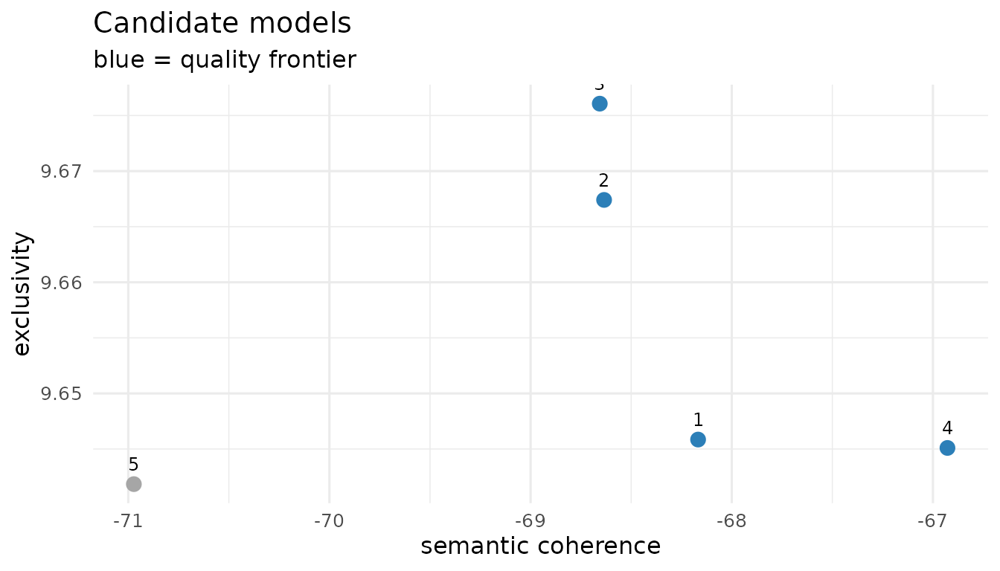
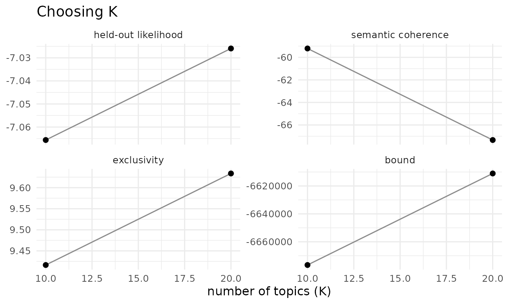
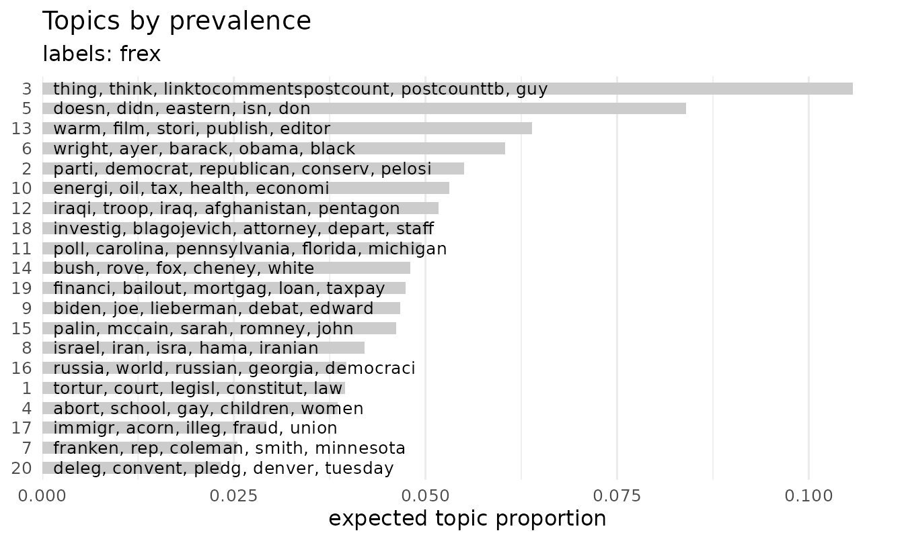
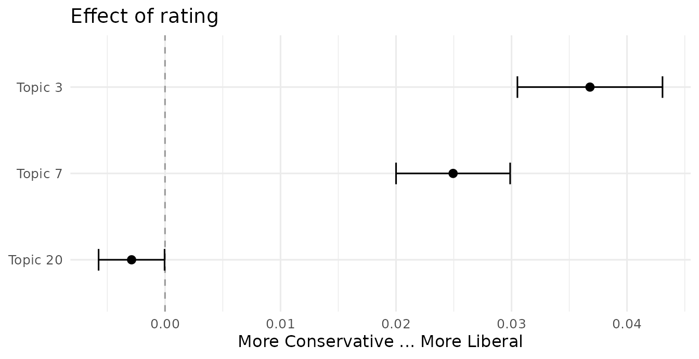
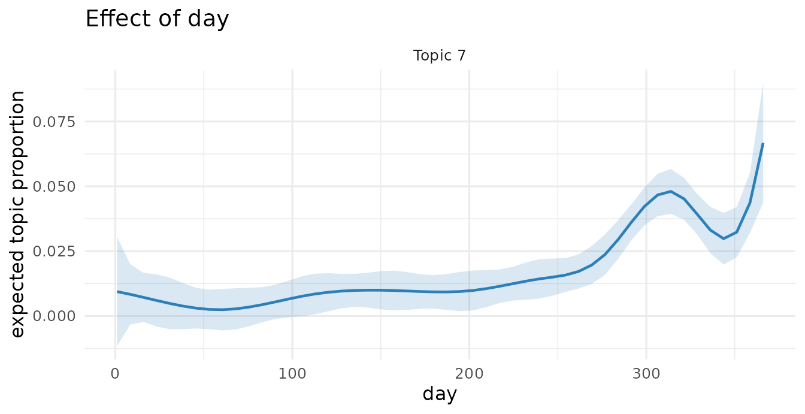
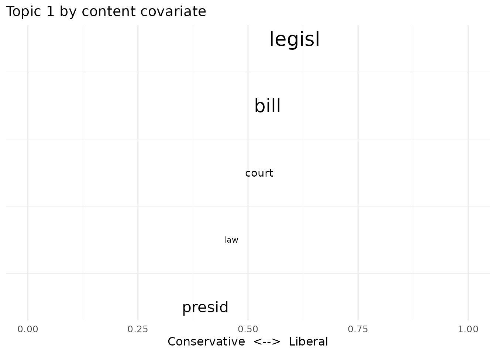
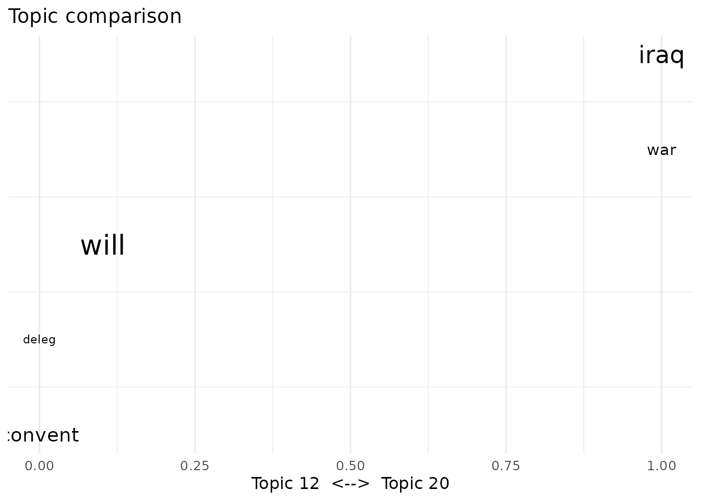
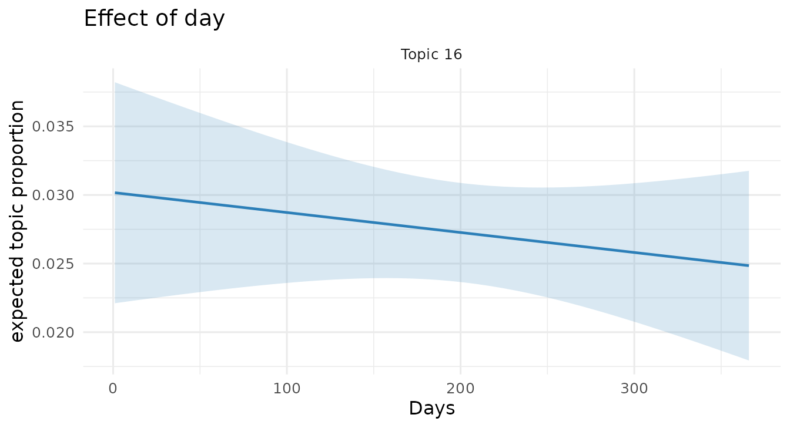
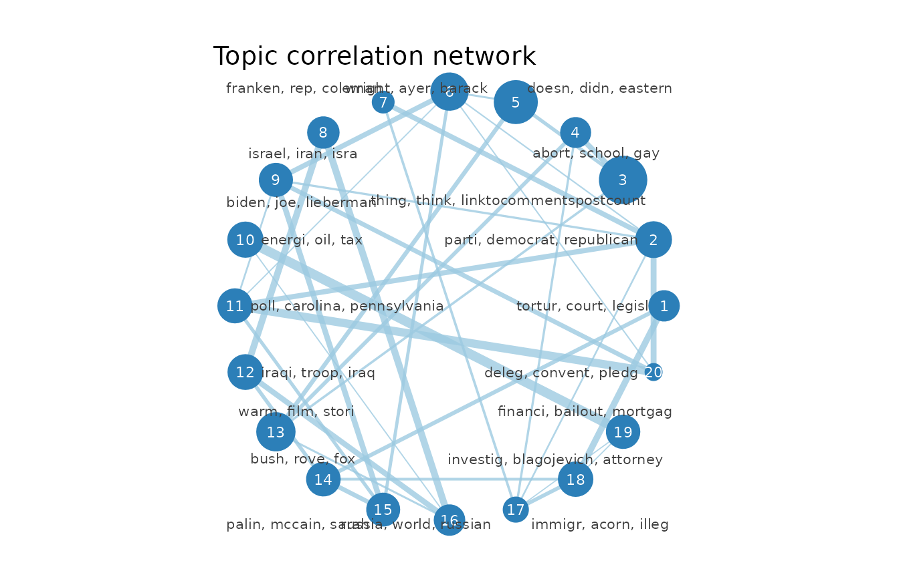

# faSTM: the stm vignette, run on faSTM

This vignette walks through the **same analysis as the `stm` package
vignette** (Roberts, Stewart & Tingley), using the identical CMU 2008
political-blog corpus — but every model is **fit live** here, because
faSTM fits in seconds where `stm` takes minutes. (The `stm` vignette
loads pre-computed objects to avoid the wait; faSTM does not need to.)
The code mirrors the `stm` vignette’s calls. Because each fit is fresh,
the *topic numbers* differ from the original — the workflow, not the
specific topics, is what carries over.

``` r

library(faSTM)
```

## Ingesting data

faSTM reads prepared text from `quanteda`/`tidytext` rather than
tokenizing itself. A typical preparation:

``` r

library(quanteda)
dfmat <- corpus(my_data, text_field = "documents") |>
  tokens(remove_punct = TRUE) |>
  tokens_remove(stopwords("en")) |>
  dfm() |>
  dfm_trim(min_termfreq = 5)
corpus <- as_corpus(dfmat)        # quanteda docvars become the metadata
```

For this vignette we use the bundled poliblog corpus (the `stm`
vignette’s `poliblog5k`), already prepared:

``` r

data(poliblog)
poliblog
#> <faSTM_corpus> 5000 documents, 2632 vocabulary terms, 4 metadata columns
out <- list(documents = poliblog$documents, vocab = poliblog$vocab, meta = poliblog$meta)
```

## Estimating the structural topic model

The headline call mirrors the `stm` vignette exactly — topic prevalence
varies with `rating` and a smooth function of `day`:

``` r

poliblogPrevFit <- stm(out$documents, out$vocab, K = 20,
                       prevalence = ~ rating + s(day), data = out$meta,
                       init.type = "Spectral", seed = 2138)
```

That fit took seconds, not minutes.

## Model selection and search

`selectModel()` fits several models from different initializations and
keeps the ones on the semantic-coherence / exclusivity frontier;
`plotModels()` shows them. (Reduced to a few candidates here to keep the
vignette quick.)

``` r

poliblogSelect <- selectModel(out$documents, out$vocab, K = 20, N = 5,
                              prevalence = ~ rating + s(day), data = out$meta, seed = 2138)
plotModels(poliblogSelect)
```



`searchK()` sweeps the number of topics, reporting held-out likelihood,
semantic coherence and exclusivity — and parallelizes across K:

``` r

storage <- searchK(out$documents, out$vocab, K = c(10, 20),
                   prevalence = ~ rating + s(day), data = out$meta, cores = 2)
plot(storage)
```



## Interpreting topics

Top words by probability, FREX, lift and score:

``` r

labelTopics(poliblogPrevFit, c(3, 7, 20))
#> Topic 3:
#>   Highest Prob: think, like, peopl, know, say, just, thing 
#>   FREX:         thing, think, linktocommentspostcount, postcounttb, guy, realli, someth 
#>   Lift:         digbyi, dday, digbi, linktocommentspostcount, postcounttb, bunch, guy 
#>   Score:        linktocommentspostcount, postcounttb, think, guy, know, thing, peopl 
#> Topic 7:
#>   Highest Prob: race, senat, gop, rep, new, campaign, dem 
#>   FREX:         franken, rep, coleman, smith, minnesota, seat, dem 
#>   Lift:         franken, coleman, minnesota, smith, mitch, mcconnel, norm 
#>   Score:        franken, dem, gop, rep, coleman, race, seat 
#> Topic 20:
#>   Highest Prob: will, convent, deleg, clinton, support, pledg, expect 
#>   FREX:         deleg, convent, pledg, denver, tuesday, nomin, superdeleg 
#>   Lift:         denver, pledg, deleg, convent, superdeleg, super, tuesday 
#>   Score:        deleg, convent, clinton, will, pledg, denver, nomin
```

Representative documents per topic, displayed as wrapped quotes:

``` r

thoughts3 <- findThoughts(poliblogPrevFit, texts = out$meta$text, n = 2, topics = 3)$docs[[1]]
plotQuote(substr(thoughts3, 1, 200), width = 50, main = "Topic 3")
```


Topics ranked by their expected prevalence in the corpus:

``` r

plot(poliblogPrevFit, type = "summary")
```



## Covariate effects on topic prevalence

[`estimateEffect()`](https://nealcaren.github.io/faSTM/reference/estimateEffect.md)
regresses topic proportions on the covariates, propagating
topic-estimation uncertainty (the honest method of composition):

``` r

out$meta$rating <- as.factor(out$meta$rating)
prep <- estimateEffect(1:20 ~ rating + s(day), poliblogPrevFit,
                       meta = out$meta, uncertainty = "Global")
summary(prep, topics = 1)$tables[[1]]
#>                   Estimate  Std. Error    t value     Pr(>|t|)
#> (Intercept)    0.003861990 0.011216067  0.3443266 7.306152e-01
#> ratingLiberal  0.019276001 0.002668439  7.2237005 5.823441e-13
#> s(day)1        0.068367873 0.022172678  3.0834287 2.057486e-03
#> s(day)2        0.038471598 0.013195646  2.9154767 3.567273e-03
#> s(day)3        0.009797603 0.016093826  0.6087802 5.426978e-01
#> s(day)4        0.054869461 0.013214713  4.1521492 3.348652e-05
#> s(day)5        0.046318512 0.014346884  3.2284718 1.252593e-03
#> s(day)6       -0.007311747 0.013476734 -0.5425459 5.874667e-01
#> s(day)7        0.030218144 0.014067854  2.1480280 3.175955e-02
#> s(day)8        0.008851424 0.016402942  0.5396242 5.894803e-01
#> s(day)9        0.057364841 0.017435673  3.2900847 1.008527e-03
#> s(day)10       0.013539769 0.016568575  0.8171957 4.138556e-01
```

Difference in topic prevalence between Liberal and Conservative blogs:

``` r

plot(prep, covariate = "rating", topics = c(3, 7, 20), model = poliblogPrevFit,
     method = "difference", cov.value1 = "Liberal", cov.value2 = "Conservative",
     xlab = "More Conservative ... More Liberal")
```



A topic’s prevalence over time (smooth term in `day`):

``` r

plot(prep, "day", method = "continuous", topics = 7, model = poliblogPrevFit)
```



## Topical content

Letting word *use within topics* vary by `rating` (a SAGE content
covariate), then comparing the two sides’ vocabulary for a topic:

``` r

poliblogContent <- stm(out$documents, out$vocab, K = 20,
                       prevalence = ~ rating + s(day), content = ~ rating,
                       data = out$meta, init.type = "Spectral", seed = 2138)
plot(poliblogContent, type = "perspectives", topics = 1)
```



Comparing the vocabulary of two topics:

``` r

plot(poliblogPrevFit, type = "perspectives", topics = c(12, 20))
```



## Interactions

Prevalence can interact covariates — here `rating` with time — and the
effect plot can condition on a moderator value:

``` r

poliblogInteraction <- stm(out$documents, out$vocab, K = 20,
                           prevalence = ~ rating * day, data = out$meta,
                           init.type = "Spectral", seed = 2138)
prepInt <- estimateEffect(c(16) ~ rating * day, poliblogInteraction,
                          metadata = out$meta, uncertainty = "None")
plot(prepInt, covariate = "day", model = poliblogInteraction, method = "continuous",
     xlab = "Days", moderator = "rating", moderator.value = "Liberal", topics = 16)
```



## More visualization

A word cloud for a topic, the topic-correlation network, and the
convergence trajectory:

``` r

cloud(poliblogPrevFit, topic = 7)
```


``` r

plot(topicCorr(poliblogPrevFit))
```



``` r

plot(poliblogPrevFit$convergence$bound, type = "l",
     ylab = "Approximate Objective", main = "Convergence")
```


## Out-of-sample documents

New documents get topic proportions by holding the fitted topics fixed:

``` r

theta_new <- fit_new_documents(poliblogPrevFit, poliblog)
dim(theta_new)
#> [1] 5000   20
```

------------------------------------------------------------------------

Everything above is the `stm` vignette’s workflow, run on faSTM: the
same function names and arguments, the same corpus, the same kinds of
plots — fit in seconds and with an honest `estimateEffect`. Existing
`stm` scripts port with little more than the changes shown here.
